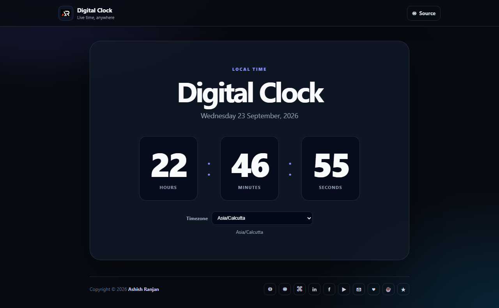

# Digital Clock

A responsive HTML, CSS, and JavaScript clock that displays live time, date, and a selectable timezone.



## Features

- Live hours, minutes, and seconds
- Current date for the selected timezone
- Timezone selector using the browser Intl API
- Fixed branded header, icon-only footer links, and go-to-top control

## Tech stack

HTML, CSS, and JavaScript.

## Run locally

Open `index.html` in a browser or use any local static server.

Deploy to GitHub Pages:

```bash
npm install
npm run deploy
```

## Links

- Portfolio: [https://www.ashishranjan.net/](https://www.ashishranjan.net/)
- GitHub: [https://github.com/a2rp](https://github.com/a2rp)
- CodePen: [https://codepen.io/ash1198](https://codepen.io/ash1198)
- LinkedIn: [https://www.linkedin.com/in/aashishranjan](https://www.linkedin.com/in/aashishranjan)
- Facebook: [https://www.facebook.com/theash.ashish/](https://www.facebook.com/theash.ashish/)
- YouTube: [https://www.youtube.com/@ashishranjan-ashz?sub_confirmation=1](https://www.youtube.com/@ashishranjan-ashz?sub_confirmation=1)
- Email: [mailto:ash.ranjan09@gmail.com](mailto:ash.ranjan09@gmail.com)

## Support

- Support: [https://a2rp-donation-page.netlify.app/](https://a2rp-donation-page.netlify.app/)
- Buy Me a Coffee: [https://buymeacoffee.com/a2rp](https://buymeacoffee.com/a2rp)
- Patreon: [https://www.patreon.com/a2rp](https://www.patreon.com/a2rp)
